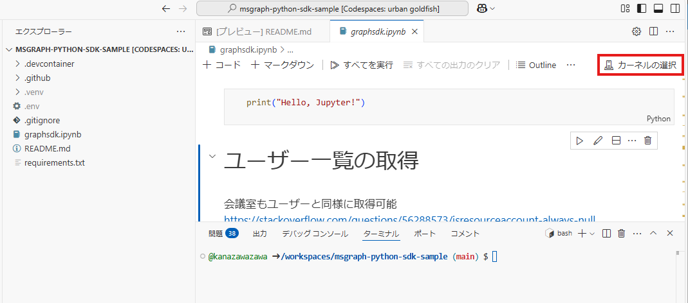

# プロジェクト概要
このプロジェクトは、Microsoft Graph API の Python SDK を利用して会議室の予約やユーザー情報の取得を行うアプリケーションです。  
仮想環境を構築し、必要な環境変数を設定することで、簡単に動作させることができます。  

主に以下のツールを使用します：
- VSCode or Codespaces
- Jupyter Notebook

主に以下の機能を提供します：
- 会議室の予約
- ユーザー情報の取得
- 会議室一覧の取得
- 空きスケジュールの取得

> ⚠️ **重要**: Jupyter Notebook の出力結果を GitHub 上に上げないよう気を付けてください。

## 免責事項

このプロジェクトは現状のまま提供されており、いかなる種類の保証もありません。  
本プロジェクトを使用したことによる損害や問題について、作成者は一切の責任を負いません。  
自己責任でご利用ください。

# 環境構築手順

## アプリの登録
1. Azure Portal Entra ID から `アプリの登録` を行います
1. `APIのアクセス許可` 
   - アクセス許可の追加
    - Microsoft Graph
        - アプリケーションの許可（委任されたアクセス許可でも可）
            - `Calendars.ReadWrite`
            - `User.Read.All`
            - `Place.Read.All`
        - 上記に対して**管理者の同意を与えます**

## Codespaces の場合（簡単）
GitHub のリポジトリで `Create codespace on main` を押してから環境が構築されるまで数分お待ちください。  
[環境変数の設定に進んでください](#環境変数の設定)


## VSCode の場合（Codespace を使用せずにローカルで開発する場合）
<details>
<summary>VSCode の場合はこちらを参照してください</summary>

### 必要な拡張機能のインストール
以下の拡張機能をインストールしてください：
- [Jupyter](https://marketplace.visualstudio.com/items?itemName=ms-toolsai.jupyter)  
- [Python](https://marketplace.visualstudio.com/items?itemName=ms-python.python)

### 仮想環境の作成
Python の仮想環境を作成します。以下のコマンドを実行してください：
```bash
python -m venv .venv
```

仮想環境を有効化するには、以下のコマンドを使用します（OS に応じて選択してください）：
- Windows:
  ```bash
    source .venv/Scripts/activate
  ```
- Linux:
  ```bash
    chmod +x .venv/bin/activate
    source .venv/bin/activate
  ```
  
`requirements.txt` を使用して `.venv` 上に依存関係をインストールします：
   ```bash
   pip install -r requirements.txt
   ```

ルートに `.env` ファイルを作成する
</details> ```

## 環境変数の設定
1. ルートの `.env` ファイルに環境変数を設定する  
    アプリの登録から、以下の値を取得して環境変数に設定します：
    - **ディレクトリ (テナント) ID**
    - **アプリケーション (クライアント) ID**
    - **クライアント シークレット**

    テストに使用するユーザーと会議室の オブジェクト ID を設定します。

#### `.env` ファイル例
```
TENANT_ID=********-****-****-****-************
CLIENT_ID=********-****-****-****-************
CLIENT_SECRET=***********************
USER_ID=********-****-****-****-************
ROOM_ID=********-****-****-****-************
```

# graphsdk.ipynb の実行
- graphsdk.ipynb を開く  （委任されたアクセス許可を使用する場合 graphsdk-InteractiveBrowserCredential.ipynb を開く）
- 右上の `カーネルの選択` で`Python環境...` を選び `.venv` を選ぶ  
  

- `すべてを実行` を押して検証する